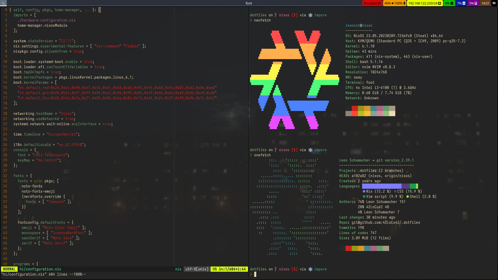

# My NixOS configuration
Beware: this config is still under construction (it takes a while to port all my old dotfiles over).

## Installation
From the NixOS live system, after mounting your partitions on `/mnt`,
start the installation process like this:
```sh
nix-shell -p git
git clone https://github.com/42LoCo42/.dotfiles -b nixos dotfiles
cd dotfiles
# edit/personalize hi/configuration.nix now...
./install.sh
``` 
Reboot and log in, then clone this repo again like before.\
Finally, run `./postinstall.sh` to create local folders and files required for the overlay mount.

## Important things
This repo will reside in your home directory, whilst being overlay-mounted to `/etc/nixos`.\
Therefore, the `.git` folder is excluded from system rebuilds, which makes developing easier.

Additionally, two important shell aliases are provided:
- `switch`: remounts /etc/nixos and runs `nixos-rebuild switch`
- `upgrade`: performs an upgrade of this configuration's flake.

## Secure boot
The [Lanzaboote](https://github.com/nix-community/lanzaboote/) bootloader is included, but not enabled by default.
To use it, first create secure boot keys:
```sh
nix-shell -p sbctl
sudo sbctl create-keys
```
Then adapt the file [secboot.nix](./secboot.nix) to your system and include it in your hardware configuration.\
Perform a system rebuild and enroll your secure boot keys:
```sh
sudo sbctl enroll-keys # sbctl will be installed system-wide by secboot.nix
```
This configuration uses full-disk encryption and automatic unlocking with [Clevis](https://github.com/latchset/clevis).
Your computer needs a Trusted Platform Module for this.
If you don't have one, remove `boot.initrd.extraUtilsCommands` and `boot.initrd.luks.devices."root".preOpenCommands`.

For more information, see the
[Lanzaboote Quickstart Guide](https://github.com/nix-community/lanzaboote/blob/master/docs/QUICK_START.md)
and [this PR](https://github.com/NixOS/nixpkgs/issues/121636) for official clevis support,
from which I have derived my configuration.

## Screenshot

