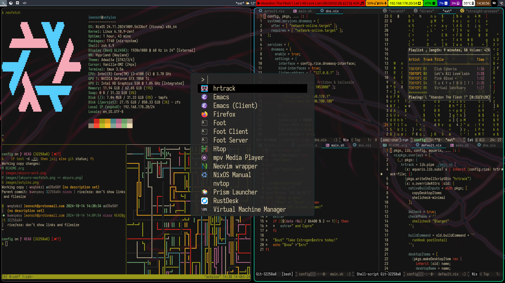
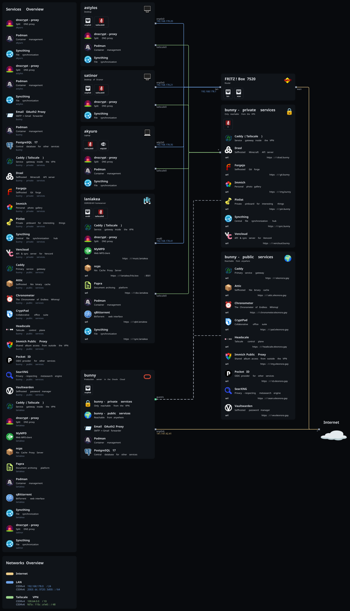

* My NixOS configuration
Abandon hope, all ye who enter here.

This config is based on my [[https://github.com/42LoCo42/aquaris][Aquaris]] library,
which provides a wealth of default options, tools and functions.

** Machines
| [[file:machines/akyuro/default.nix][akyuro]]   | Laptop             |
| [[file:machines/astylos/default.nix][astylos]]  | Desktop            |
| [[file:machines/bunny/default.nix][bunny]]    | Server             |
| [[file:machines/guanyin/default.nix][guanyin]]  | Live ISO           |
| [[file:machines/laniakea/default.nix][laniakea]] | Odroid M1          |
| [[file:machines/satinor/default.nix][satinor]]  | Desktop of [[https://github.com/Ercanar][Ercanar]] |

** Software
| Kernel         | [[https://github.com/zen-kernel/zen-kernel][Zen]]       |
| Scheduler      | [[https://github.com/sched-ext/scx/tree/main/scheds/rust/scx_lavd][scx_lavd]]  |
| Greeter        | [[https://github.com/apognu/tuigreet][tuigreet]]  |
| Window manager | [[https://github.com/hyprwm/Hyprland][Hyprland]]  |
| Bar            | [[https://github.com/Alexays/Waybar][Waybar]]    |
| Font           | [[https://typeof.net/Iosevka][Iosevka]]   |
| Terminal       | [[https://codeberg.org/dnkl/foot][foot]]      |
| Shell          | [[https://www.zsh.org][Zsh]]       |
| Editor         | [[https://www.gnu.org/software/emacs][GNU Emacs]] |
| Browser        | [[https://librewolf.net][LibreWolf]] |
| Messenger      | [[https://github.com/Vencord/Vesktop][Vesktop]]   |
| Music Player   | [[https://github.com/MusicPlayerDaemon/MPD][MPD]]       |

** Screenshot

** Topology

